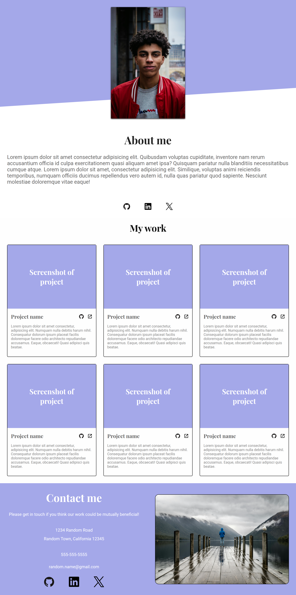
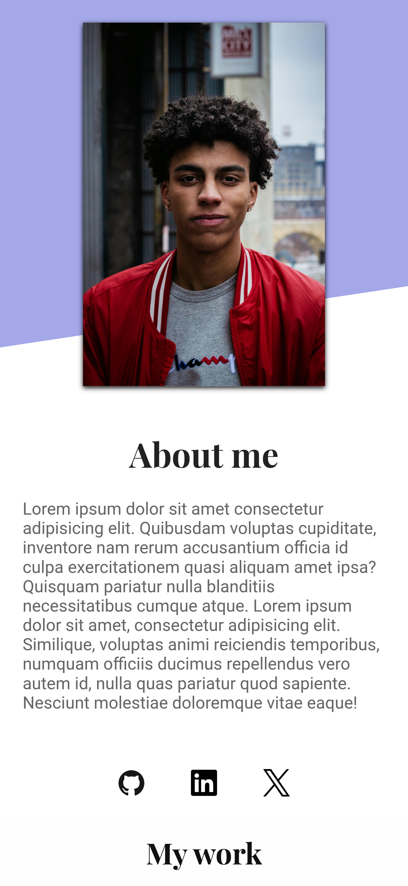
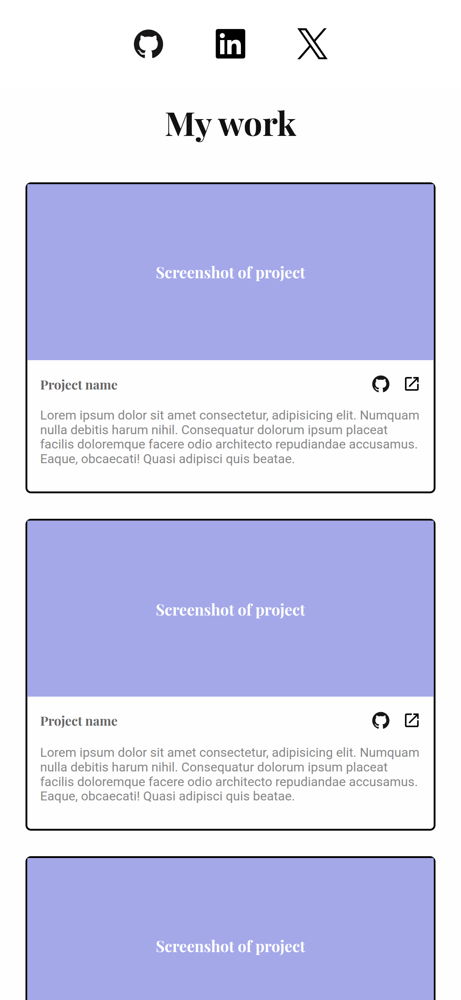
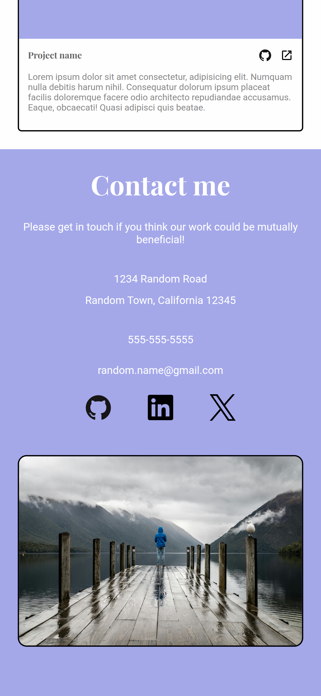
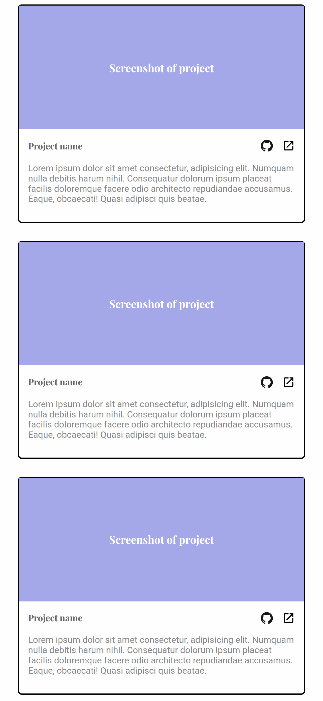

# Homepage

A simple landing page, built with **HTML** and **Responsive CSS**. This project demonstrates advanced HTML and CSS design skills.

## Technologies Used

- **HTML5** for page structure
- **CSS3** for styling and responsive design

## Live Demo

[View Live Demo](https://kylehomepageexample.netlify.app/)


## Screenshots




<p align="center">
  
  
</p>
<p align="center">
  
  
</p>


## Installation & Setup

If you want to run this locally:

1. Clone the repository:
   ```bash
   git clone https://github.com/kylepunta/Homepage.git
